

  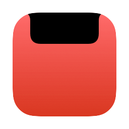

<h1 align="center">NotchDeck</h1>

  <b>Чёлка, которая умеет больше.</b> 
  Плеер, скриншоты, буфер обмена и переводчик — прямо под вырезом MacBook.

  

  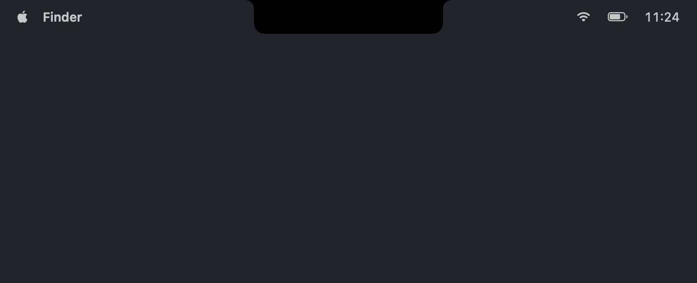

  Наведите курсор на чёлку — панель выезжает. Уведите — сворачивается. 
  Ни окна, ни лишних кликов: приложение живёт в строке меню.

---

<h2 align="center">hello.</h2>

  При запуске из чёлки спускается приветствие и пишется от руки — 
  как на новом Mac. Пара секунд, и оно уезжает обратно.

  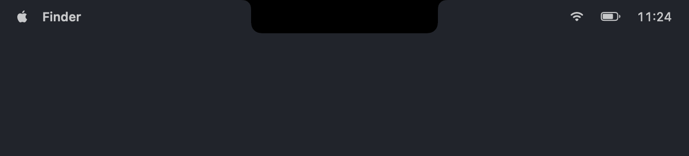

---

<h2 align="center">Музыка. На расстоянии взгляда.</h2>

  Всё, что играет в системе: Музыка, Spotify, Яндекс Музыка, видео в браузере. 
  Обложка, крупные кнопки, перемотка с кружком и громкость сбоку.

  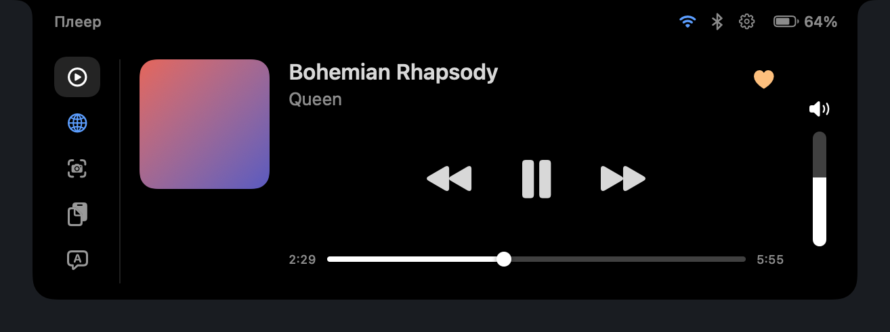

- **Нравится — в одно касание.** Сердечко у музыки, палец вверх у видео. Отмеченное
  загорается жёлтым. Кнопка появляется, только если плеер сам это умеет: Музыка — да,
  видео в браузере — нет.
- **Громкость рядом.** Вертикальная полоса справа — та же громкость, что в меню-баре.
  Нажмите на динамик, чтобы выключить звук.
- **Плеер на чёлке.** Пока играет музыка, чёлка расширяется: слева обложка, справа
  эквалайзер в её цвет.

---

<h2 align="center">Громкость. Там, куда вы смотрите.</h2>

  Клавиши громкости больше не вызывают системный индикатор посреди экрана. 
  Уровень появляется прямо в чёлке. Выключили звук — значок краснеет и вздрагивает.

  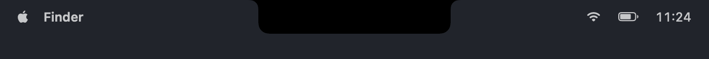

> Чтобы перехватывать клавиши громкости, macOS просит разрешение
> **«Универсальный доступ»**. Без него всё работает как обычно — просто остаётся
> системный индикатор.

---

<h2 align="center">Скриншоты. Сразу под рукой.</h2>

  Свежие снимки появляются сами. Клик — копия в буфере. Перетащили — файл уже в чате. 
  Синяя папка у заголовка открывает их в Finder.

  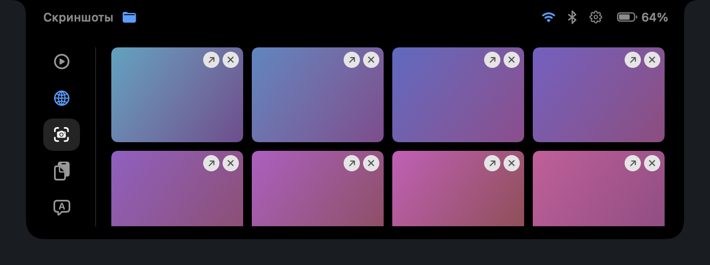

---

<h2 align="center">Буфер обмена. С памятью.</h2>

  История скопированного с закреплением и поиском по мере набора. 
  Пароли из менеджеров паролей не сохраняются никогда.

  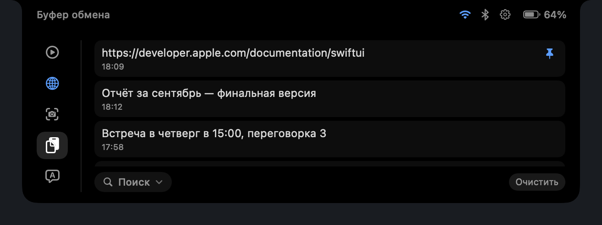

  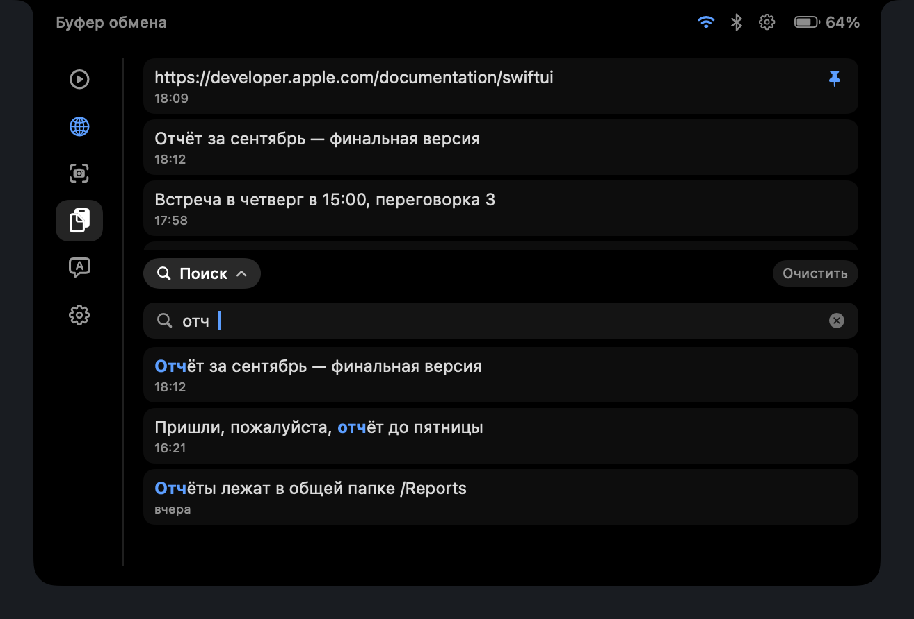

---

<h2 align="center">Переводчик. Без интернета.</h2>

  Русский ↔ английский на языковых моделях Apple — локально, без ключей. 
  Язык определяется сам, недописанное слово подсказывается, <b>Tab</b> дописывает.

  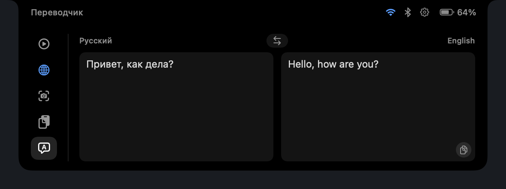

<table>
  <tr>
    <td align="center"><b>Варианты и примеры</b> словарь Яндекса и Tatoeba — только по нажатию</td>
    <td align="center"><b>История</b> последние 50 переводов</td>
    <td align="center"><b>Избранное</b> всё, что отмечено звёздочкой</td>
  </tr>
  <tr>
    <td>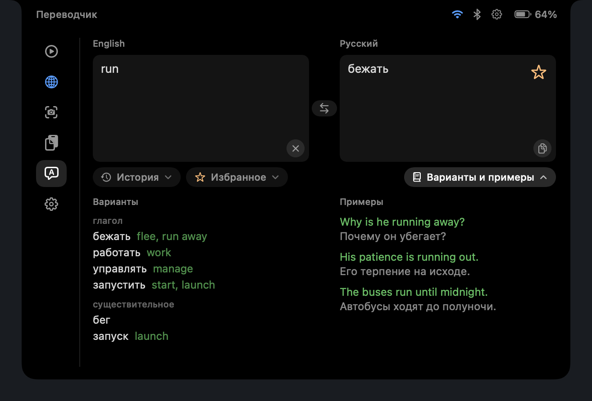</td>
    <td>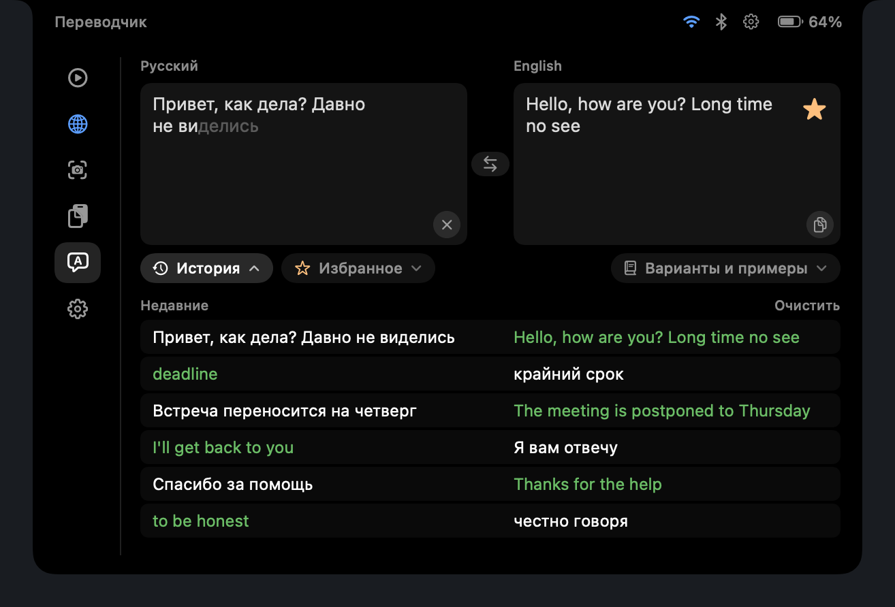</td>
    <td>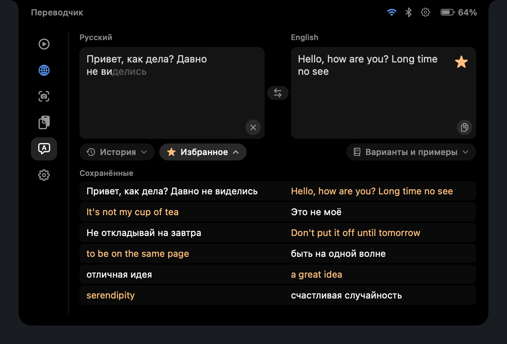</td>
  </tr>
</table>

---

<h2 align="center">Поиск. Одной строкой.</h2>

  Запрос уходит в Google в браузере по умолчанию. Пока вы печатаете, панель не закроется.

  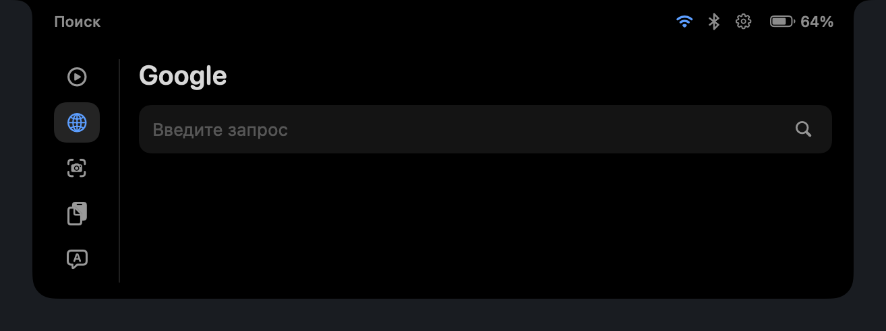

---

<h2 align="center">Настроено под вас.</h2>

  Разделы переключаются простым наведением. Шестерёнка — последней строкой в списке: 
  плеер на паузе, приветствие при запуске, громкость на чёлке.

  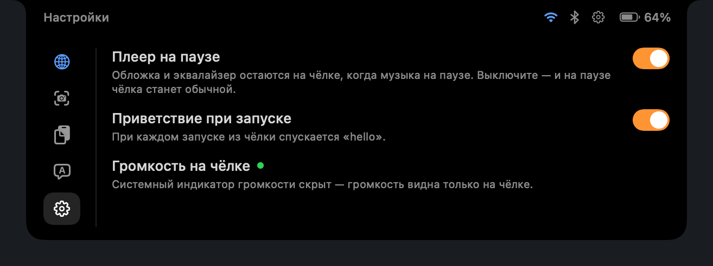

---

## Установка

1. Скачайте `NotchDeck.zip` на [странице релиза](../../releases/latest).
2. Распакуйте и перетащите `NotchDeck.app` в Программы.
3. При первом запуске macOS скажет, что файл «не был открыт», — приложение не подписано
   Apple Developer ID (это платная подписка). Как открыть, показано на странице релиза.

Xcode не нужен. Требуется macOS 26.1 и MacBook с чёлкой; на мониторе без чёлки панель
живёт у верхнего края экрана.

## Под капотом

- **Плеер** читает системный MediaRemote. С macOS 15.4 он отвечает только процессам,
  подписанным Apple, поэтому запросы идут через `/usr/bin/perl` — подробности в
  [`MediaAdapter/MediaRemoteAdapter.m`](MediaAdapter/MediaRemoteAdapter.m).
- **Скриншоты** берутся из папки `com.apple.screencapture` и распознаются по флагу
  Spotlight `kMDItemIsScreenCapture`, а не по локализованному имени файла.
- **Буфер обмена** не сохраняет записи с пометкой `org.nspasteboard.ConcealedType`.
- **Переводчик** работает на системном фреймворке `Translation`. В сеть ходят только
  варианты и примеры, и только по нажатию кнопки.

Что изменилось в каждой версии — в [CHANGELOG](CHANGELOG.md). Полное руководство —
[Docs/NotchDeck.pdf](Docs/NotchDeck.pdf).
