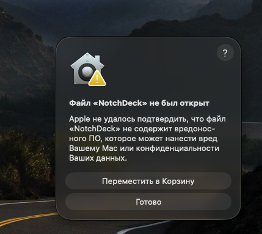
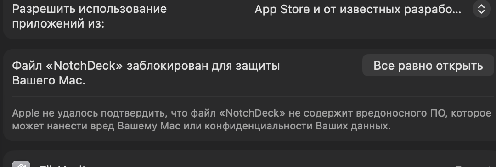

# NotchDeck

Плашка, которая живёт под чёлкой MacBook. Наводишь курсор на чёлку — панель
выезжает; уводишь курсор — сворачивается обратно. Без окна, без иконки в Dock —
приложение работает как аксессуар в строке меню.

Пять разделов: **плеер**, **поиск**, **скриншоты**, **буфер обмена**,
**переводчик**, плюс верхняя полоса с зарядом батареи и переключателем Wi-Fi.

## Скачать

Скачайте `NotchDeck.zip`, распакуйте и перетащите `NotchDeck.app` в
Программы.

Xcode для этого не нужен. Но приложение не подписано Apple Developer ID (это
платная подписка, а сборка бесплатная), поэтому при первом запуске macOS
скажет, что файл «не был открыт». Это ожидаемо, вот как открыть:

1. Нажмите **«Готово»** в этом диалоге, затем откройте **Системные
   настройки → Конфиденциальность и безопасность** и прокрутите вниз до
   блока «Безопасность».
2. Там будет строка «Файл «NotchDeck» заблокирован для защиты Вашего Mac» —
   нажмите **«Все равно открыть»** и подтвердите ещё раз в диалоге.

Дальше приложение открывается обычным двойным кликом.

## Разделы

### Плеер

Что играет где-либо в системе (Music, Spotify, видео в браузере): обложка,
название, перемотка позиции, кнопки управления. Когда панель свёрнута, рядом
с чёлкой остаётся маленький эквалайзер, подсвеченный цветом обложки.

### Поиск

Поле запроса, открывающее Google в браузере по умолчанию. Пока поле в
фокусе, панель не закрывается, так что увод курсора во время набора текста
её не сворачивает.

### Скриншоты

Сетка последних снимков экрана, новые сверху. Клик копирует (сразу и файл, и
изображение, поскольку одним приложениям нужен файл, а другим — картинка),
перетаскивание вытаскивает файл, кнопки на карточке открывают его или
отправляют в Корзину. Папка берётся из `com.apple.screencapture`, а файлы
распознаются по флагу Spotlight `kMDItemIsScreenCapture`, а не по имени
файла, которое локализовано.

### Буфер обмена

История скопированного текста с закреплением. Записи с пометкой
`org.nspasteboard.ConcealedType` (менеджеры паролей) никогда не сохраняются.

### Переводчик

Русский ↔ английский поверх системного фреймворка `Translation`. Работает
локально, без ключей и без сети; языковой пакет macOS скачивает сама при
первом использовании.

